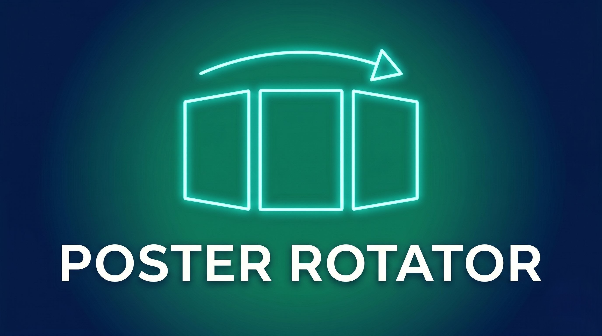

  

<h1 align="center">Jellyfin Poster Rotator</h1>

  
  

  <strong>Poster Rotator garde votre interface Jellyfin dynamique en faisant tourner les affiches (posters) de vos médias selon un planning défini.</strong>

---

> [!IMPORTANT]
> ### ⚙️ PRÉREQUIS & COMPATIBILITÉ
> - **Version Jellyfin** : `10.11.0.0` à `10.11.8.0`.
> - **Runtime** : .NET 9 requis sur le serveur Jellyfin.
> - **Fournisseurs d'images** : TMDb, TVDB ou Fanart doivent être activés.

---

## 🔌 Installation (Méthode Recommandée : Dépôt Jellyfin)

Privilégiez l'installation via le dépôt officiel pour bénéficier des mises à jour automatiques directement depuis votre interface Jellyfin.

### 1. Ajouter le dépôt
1. Dans Jellyfin : **Tableau de bord** > **Plugins** > **Dépôts**.
2. Cliquez sur le bouton `+` (Ajouter).
3. Remplissez les informations suivantes :
   - **Nom** : `Poster Rotator`
   - **URL** : `https://raw.githubusercontent.com/maelmoreau21/jellyfin-plugin-poster-rotator/refs/heads/main/manifest.json`

### 2. Installation
1. Allez dans l'onglet **Catalogue**.
2. Recherchez **Poster Rotator** et installez-le.
3. **Redémarrez Jellyfin** pour activer le plugin.

---

## ⚙️ Configuration

Une fois installé, rendez-vous dans **Tableau de bord** > **Plugins** > **Poster Rotator** pour personnaliser le comportement :

- **Pool Size** : Nombre d'affiches candidates conservées par élément.
- **Pool Storage** : Emplacement du stockage (Dossier data du plugin recommandé).
- **Min Hours Between Switches** : Temps d'attente minimal avant une nouvelle rotation.
- **Sequential Rotation** : Rotation dans un ordre stable plutôt qu'aléatoire.
- **Language Filter** : Priorise les affiches dans votre langue préférée.

> [!TIP]
> Utilisez le mode **Plugin data folder** pour garder vos dossiers médias propres et éviter que Jellyfin ne scanne inutilement les fichiers du pool.

---

## 🛠️ Installation Manuelle (Optionnelle)

Si vous ne pouvez pas utiliser le dépôt :
1. Téléchargez le fichier `Jellyfin.Plugin.PosterRotator.dll` depuis les [Releases](https://github.com/maelmoreau21/jellyfin-plugin-poster-rotator/releases).
2. Créez un dossier `PosterRotator` dans votre répertoire `plugins` Jellyfin.
3. Copiez le fichier `.dll` dedans et redémarrez Jellyfin.

---

## 📄 Licence

Distribué sous licence **MIT**.
